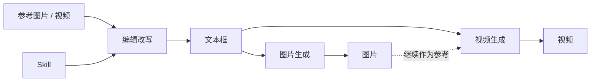

<div align="center">

**A G E N T C A N V A S**

# 把创作流程，放到一张画布上。

从参考素材、提示词到图片与视频。<br>
在本地连接节点，让每一步创作都有迹可循。

**无限画布 · 多模型接入 · 本地保存 · Codex 自动化**

[快速开始](#快速开始) · [创作工作流](#创作工作流) · [接入服务](#接入服务) · [使用指南](docs/guide.md) · [Codex 插件](#codex-插件)

</div>

---

## 一个连续的创作空间

Agent Canvas 是运行在本机的节点式 AI 创作工作台。将素材、提示词与生成任务连接在一起，在同一张画布里组织思路、比较结果、继续迭代。

| 创作 | 组织 | 掌控 |
| :--- | :--- | :--- |
| **提示词 → 图像 → 视频**<br>参考素材与生成结果可继续连接到下游节点。 | **无限画布与节点群组**<br>用预设快速起步，用多画布标签管理不同项目。 | **可见的任务进度**<br>查看真实执行阶段，支持排队、取消和重跑。 |
| **可组合的 Skill**<br>选择内置规则、注册本机 Skill，或直接使用无 Skill 模式。 | **适合长时间工作的界面**<br>本地 Geist 字体、浅色与深色主题、可收起的侧栏。 | **本地文件与输出目录**<br>保存画布、导出分享，并将生成素材自动写入磁盘。 |

## 快速开始

需要 **Node.js 22.13.0 或更新版本**、npm 和 Git。生成内容时，还需配置至少一个对应的服务；仅浏览和编辑画布无需先配置全部渠道。

```sh
git clone https://github.com/bojyu/agent-canvas.git
cd agent-canvas
npm ci
npm run dev
```

打开 **[127.0.0.1:4173](http://127.0.0.1:4173)**。开发命令同时启动网页与本地桥接服务，使用期间请保持终端运行。Windows 也可通过仓库中的 `启动提示词画板.cmd` 启动。

1. **接入服务** — 使用 Codex 前先在本机完成 `codex login`；API 渠道可在顶部「API 密钥」中配置。
2. **添加预设** — 从左侧选择「常规提示词」「图片生成」或「视频生成」，创建已连接的节点。
3. **开始创作** — 添加参考素材、填写需求并选择模型，点击生成后在任务中心查看进度。

> 预设只创建节点与连线。生成请求在提交并开始执行任务后发出；模型可用性、额度与费用取决于所选服务。

## 创作工作流

下面是可组合的创作路径示意。当前按单个生成节点执行，节点之间的连线用于传递内容。



- **打磨提示词**：选择 Seedance、Nano Banana、GPT Image 或真实感场景规则；也可使用「不加载 Skill」，直接根据需求与素材改写。
- **生成图像**：在节点中设置模型、画幅与分辨率，接入最多 12 张参考图，结果写回图片节点。
- **生成视频**：支持文生视频、单图、首尾帧、智能多帧与全能参考模式，具体能力以所选渠道和模型为准。
- **复用与分享**：复制节点或群组，保留选中节点之间的内部连线；通过 `.promptflow.json` 分享画布与素材。

快捷键、Skill 管理、媒体导入和群组操作见[画布操作指南](docs/guide.md#画布操作)。

## 接入服务

提示词改写与媒体生成使用各自的服务配置，可在节点中独立选择。

| 用途 | 已接入渠道 | 本地配置方式 |
| :--- | :--- | :--- |
| 提示词改写 | Codex | 本机 Codex CLI 登录状态 |
| 提示词改写 | OpenRouter / Comfly | 对应 API Key |
| 提示词改写 | Grok Build / Antigravity | 本机 `grok` / `agy` CLI 登录状态 |
| 图片生成 | OpenRouter / Google Gemini / Comfly | 对应 API Key |
| 视频生成 | OpenRouter / Comfly / Seedance CLI | API Key 或本机 `dreamina` 登录状态 |

顶部「API 密钥」设置保存后立即生效。也可将 [`.env.example`](.env.example) 复制为 `.env.local`，填写需要的字段并重启服务。

<details>
<summary><strong>展开常用环境变量</strong></summary>

```dotenv
OPENROUTER_API_KEY=
GEMINI_API_KEY=
COMFLY_API_KEY=
COMFLY_LLM_API_KEY=
COMFLY_GPT_IMAGE_2_1K_API_KEY=
COMFLY_GPT_IMAGE_2_2K_API_KEY=
COMFLY_GPT_IMAGE_2_4K_API_KEY=
```

Comfly 提示词优先使用 `COMFLY_LLM_API_KEY`，为空时使用通用 Key。Comfly GPT Image 2 按 1K / 2K / 4K 分别配置专用 Key，不会回退到通用 Key。

</details>

CLI 路径、参考素材处理和各渠道的配置说明见[服务配置指南](docs/guide.md#服务配置)。

## Codex 插件

通过仓库内的 [Agent Canvas 插件](plugins/agent-canvas)，让 Codex 直接读取画布、创建节点与连线、应用预设、挂载素材并运行单个生成节点。

1. 运行 `npm run dev`，并在 Codex App 中打开本仓库。
2. 从本地市场 `agent-canvas-local` 安装 **Agent Canvas**；若市场尚未显示，可重启 App 后查看。
3. 开启新对话，加载插件的 Skill 与 MCP 工具。

插件通过带版本检查的语义接口修改画布，先预检再提交。后台任务与网页共用任务中心，浏览器关闭后仍可由运行中的本地服务完成任务并保存结果。

同一套能力也提供 CLI：

```sh
npm run canvas -- status
npm run canvas -- projects
npm run canvas -- inspect <projectId>
npm run canvas -- preset <projectId> image-generation --expected-revision <revision> --dry-run
```

当前支持单节点执行；完整 DAG 调度与成本预算属于后续规划。详见[插件设计文档](docs/plans/agent-canvas-codex-plugin.md)。

## 数据与任务

**画布保存在本机，模型请求发送至所选服务。** 提示词、参考图片及视频素材的处理方式随渠道不同，详见[数据与隐私](docs/guide.md#数据与隐私)。

| 数据 | 默认位置或行为 |
| :--- | :--- |
| 画布项目 | `.prompt-flow-data/projects` |
| 图片与视频输出 | `.prompt-flow-data/outputs`，可在顶部更改 |
| 最近任务记录 | `.prompt-flow-data/tasks.json`，保留最近 20 条 |
| API 密钥 | 本机 `.env.local` 与桥接进程；不写入画布或分享文件 |
| 分享文件 | 包含节点、连线与素材；不携带 Agent 会话标识 |

任务默认并行数为 **2**，可切换为 1 / 2 / 3。排队中的任务尚未调用模型；同一输出节点不会同时接受多个任务。任务中心支持定位节点、查看结果、取消、复制错误与重跑。

## 开发与文档

界面基于 **React 19、React Flow、Tailwind CSS 4 与 GSAP**；构建使用 **vinext / Vite**，本地 Node.js 桥接服务负责模型调用、任务和文件读写。

```sh
npm run lint       # 静态检查
npm run build      # 构建应用
npm test           # 构建并运行测试
```

[完整使用指南](docs/guide.md) · [插件设计](docs/plans/agent-canvas-codex-plugin.md) · [反馈问题](https://github.com/bojyu/agent-canvas/issues)

---

**维护者** · [bojyu](https://github.com/bojyu)

**本次文档整理与编排** · Codex（OpenAI）协助完成
